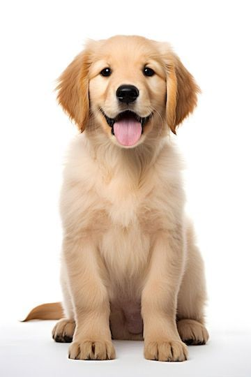

# 🧠 Computer Vision Project - Cartoonify an Image

This project demonstrates how to transform a regular image into a **cartoon-style image** using OpenCV. It's built specifically for execution in **Google Colab**, making use of Colab’s built-in tools for image display and file handling.

---

## 🖼️ Sample Output

| Original Image | Cartoonified Image |
|----------------|--------------------|
|  |  |

---

## 🧰 Tech Stack

- Python 3.x
- OpenCV (`cv2`)
- PIL (Python Imaging Library)
- Google Colab tools (`cv2_imshow`, `files.upload`, `files.download`)

---

## 📂 Code Overview

```python
# Import necessary libraries
from google.colab.patches import cv2_imshow
import cv2
import io
from PIL import Image
from google.colab import files

# Load image
img = cv2.imread('pup.jpg')

# Pre-processing
Grey_img = cv2.cvtColor(img, cv2.COLOR_BGR2GRAY)
grey_blur = cv2.medianBlur(Grey_img, 5)
cv2_imshow(grey_blur)

# Edge detection
edges = cv2.Canny(grey_blur, 100, 200)
cv2_imshow(edges)

# Adaptive thresholding
edge = cv2.adaptiveThreshold(grey_blur, 255, cv2.ADAPTIVE_THRESH_MEAN_C, cv2.THRESH_BINARY, blockSize=9, C=9)
cv2_imshow(edge)

# Display original and cartoon image
print("Original image")
cv2_imshow(img)

print("Cartoon image")
cartoon = cv2.bitwise_and(img, img, mask=edge)
cv2_imshow(cartoon)

# Save and download cartoon image
cv2.imwrite('cartoon.jpg', cartoon)
files.download('cartoon.jpg')
