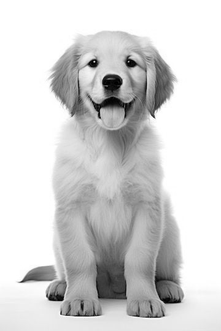
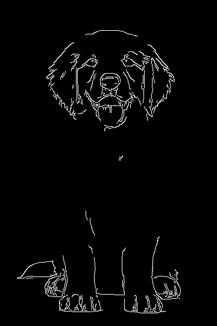
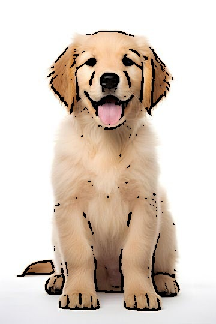

# 🧠 Computer Vision Project - Cartoonify an Image

This project demonstrates how to transform a regular image into a **cartoon-style image** using OpenCV. It's built specifically for execution in **Google Colab**, making use of Colab’s built-in tools for image display and file handling.

---
## Try to run in code in google colab as it is written on colab and will work fine.
## 🖼️ Sample Output

| Original Image | Grayscale Image | 
|----------------|-----------------|
|  |  |

| Canny Edges |  Cartoon Image |
|-------------|--------------------|
|  |  |

---

## 🧰 Tech Stack

- Python 3.x
- OpenCV (`cv2`)
- PIL (Python Imaging Library)
- Google Colab tools (`cv2_imshow`, `files.upload`, `files.download`)

---

## 📂 Code Overview

```python
# Import libraries
from google.colab.patches import cv2_imshow
import cv2
import io
from PIL import Image
from google.colab import files

# Load image
img = cv2.imread('pup.jpg')

# Grayscale conversion
Grey_img = cv2.cvtColor(img, cv2.COLOR_BGR2GRAY)
cv2_imshow(Grey_img)
cv2.imwrite('grey.jpg', Grey_img)

# Apply median blur
grey_blur = cv2.medianBlur(Grey_img, 5)
cv2_imshow(grey_blur)
cv2.imwrite('blur.jpg', grey_blur)

# Canny edge detection
edges = cv2.Canny(grey_blur, 100, 200)
cv2_imshow(edges)
cv2.imwrite('canny.jpg', edges)

# Adaptive thresholding
edge = cv2.adaptiveThreshold(grey_blur, 255, cv2.ADAPTIVE_THRESH_MEAN_C,
                             cv2.THRESH_BINARY, blockSize=9, C=9)
cv2_imshow(edge)
cv2.imwrite('adaptive.jpg', edge)

# Show original image
print("Original image")
cv2_imshow(img)

# Cartoonify the image
print("Cartoon image")
cartoon = cv2.bitwise_and(img, img, mask=edge)
cv2_imshow(cartoon)
cv2.imwrite('cartoon.jpg', cartoon)

# Download cartoon image
files.download('cartoon.jpg')
```
## 📦 How to Use
- Open the notebook in Google Colab.

- Upload your image as pup.jpg (or change the filename).

- Run all cells to visualize the process:

- Grayscale

- Blurred

- Edges

- Cartoonified output

- The cartoonified image is saved and downloaded as cartoon.jpg.

## 💡 Concepts Used
- Grayscale conversion

- Median blurring

- Canny edge detection

- Adaptive thresholding

- Bitwise masking for cartoon effect

## 📜 License
- This project is licensed under the MIT License.

## 🤝 Contributing
- Contributions and suggestions are welcome! Feel free to open an issue or pull request.

## Made with ❤️ using Python, OpenCV, and Google Colab.

---

### 📌 Note:
To make the image previews (`grey.jpg`, `blur.jpg`, `canny.jpg`, etc.) visible on GitHub:
- Make sure to run the script once and **upload the generated images to your GitHub repo**.
- Then, GitHub will show them in your `README.md`.

Would you like me to also make a `.ipynb` (Jupyter Notebook) version for this that you can directly upload to Colab or GitHub?
